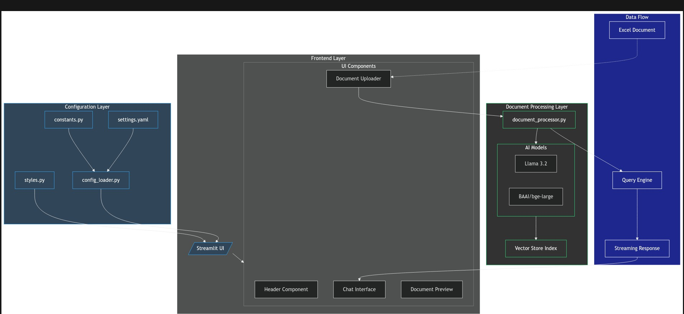

# My Building of AI Warehouse Manager

Warehousing Meets AI: A No-Nonsense Guide to Smarter Inventory Management

TL;DR

A hands-on guide showing how to build an AI-powered warehouse management system using Python and modern AI technologies. The system helps businesses analyze inventory data, predict stock needs, and make smarter warehouse decisions through natural language interactions.

Full Article : [https://medium.com/@learn-simplified/practical-guide-my-building-of-ai-warehouse-manager-35a278e0762d


Tech stack
# AI Warehouse Manager Technical Stack

## Frontend Technologies
| Technology | Purpose | Implementation Details |
|------------|---------|------------------------|
| Streamlit | Web Framework | Powers the interactive web interface with built-in components and state management |
| Custom CSS | Styling | Dark theme implementation with professional color schemes and responsive design |
| Session State | User Management | UUID-based session tracking and state persistence |
| Wide Layout | UI/UX | Responsive design with collapsible sidebar and multi-column layout |

## AI and Machine Learning
| Technology | Purpose | Implementation Details |
|------------|---------|------------------------|
| Llama 3.2 (3B) | Language Model | Processes natural language queries and generates contextual responses |
| BAAI/bge-large | Embeddings | Creates document embeddings for semantic search capabilities |
| Vector Store Index | Search Engine | Indexes document content for efficient query processing |
| Markdown Node Parser | Content Processing | Structures document content for AI processing |

## Data Processing
| Technology | Purpose | Implementation Details |
|------------|---------|------------------------|
| Pandas | Data Manipulation | Handles Excel file processing and data transformations |
| DoclingReader | Excel Processing | Specialized reader for extracting structured data from Excel files |
| SimpleDirectoryReader | File Management | Manages document loading and processing pipelines |
| Garbage Collection | Memory Management | Optimizes memory usage during long-running sessions |

## Configuration Management
| Technology | Purpose | Implementation Details |
|------------|---------|------------------------|
| YAML | Settings Storage | Stores application configuration in human-readable format |
| Python Constants | System Values | Defines system-wide constants and configuration values |
| JSON | Model Settings | Manages AI model configurations and parameters |
| Config Loader | Integration | Centralizes configuration management across the application |

## Core Dependencies
| Technology | Purpose | Implementation Details |
|------------|---------|------------------------|
| Asyncio | Async Operations | Enables non-blocking operations for better performance |
| TempFile | File Handling | Manages temporary file operations during document processing |
| NumPy | Numerical Operations | Supports data processing and mathematical operations |
| UUID4 | Unique Identifiers | Generates unique identifiers for session and document tracking |

## Development Tools
| Technology | Purpose | Implementation Details |
|------------|---------|------------------------|
| Python 3.x | Core Language | Primary development language for the entire application |
| Git | Version Control | Manages source code versioning and collaboration |
| Virtual Environment | Dependency Management | Isolates project dependencies and ensures consistency |

## Security Features
| Technology | Purpose | Implementation Details |
|------------|---------|------------------------|
| Session Management | User Isolation | Ensures user data and queries remain isolated |
| File Validation | Upload Security | Validates file types and content before processing |
| Memory Cleanup | Resource Management | Automatically cleans up temporary files and resources |


## Introduction
In today’s fast-paced business environment, the difference between success and failure often comes down to how quickly and accurately you can make decisions. While artificial intelligence might sound futuristic, this article demonstrates a practical, implementable way to bring AI into everyday warehouse operations. Through our example warehouse system, you’ll see how AI can:

 - Transform complex data analysis into simple conversations
- Help predict inventory needs before shortages occur
- Reduce the time spent training new staff on complex systems
- Enable faster, more accurate decision-making

Even though our example uses a fictional warehouse, the principles and implementation details apply to real-world businesses of any size looking to modernize their operations.

## Architecture

### My Building of AI Warehouse Manager





# Tutorial: My Building of AI Warehouse Manager

## Prerequisites
- Python installed on your system.
- A basic understanding of virtual environments and command-line tools.

## Steps

1. **Virtual Environment Setup:**
   - Create a dedicated virtual environment for our project:
   
     ```bash
     python -m venv My-Building-of-AI-warehouse-manager
     ```
   - Activate the environment:
   
     - Windows:
       ```bash
       My-Building-of-AI-warehouse-manager\Scripts\activate       
       ```
     - Unix/macOS:
       ```bash
       source My-Building-of-AI-warehouse-manager/bin/activate
       ```
   

# Installation and Setup Guide

**Install Project Dependencies:**

Follow these steps to set up and run the  "My Building of AI Warehouse Manager"

1. Navigate to your project directory:
   ```
   cd path/to/your/project
   ```
   This ensures you're in the correct location for the subsequent steps.

2. Install the required dependencies:
   ```
   pip install -r requirements.txt   
   ```
   This command installs all the necessary Python packages listed in the requirements.txt file.


## Run - Hands-On Guide: My Building of AI Warehouse Manager

   ```bash 
     
      # Run 
      streamlit run app.py
      
   ```